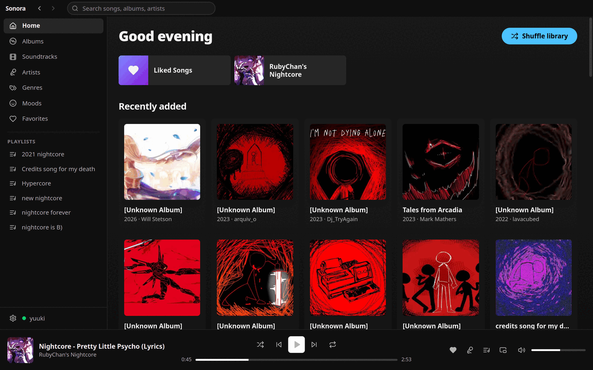
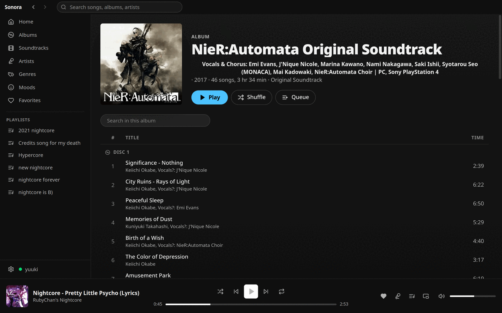
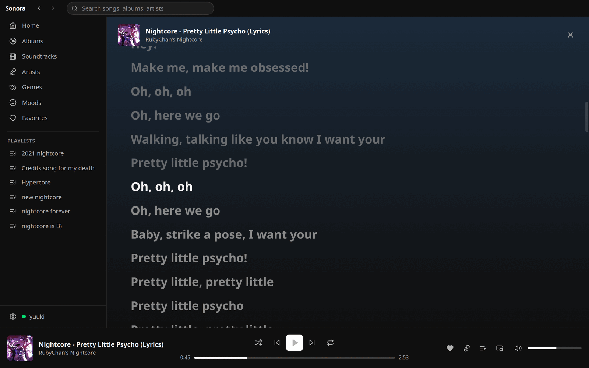
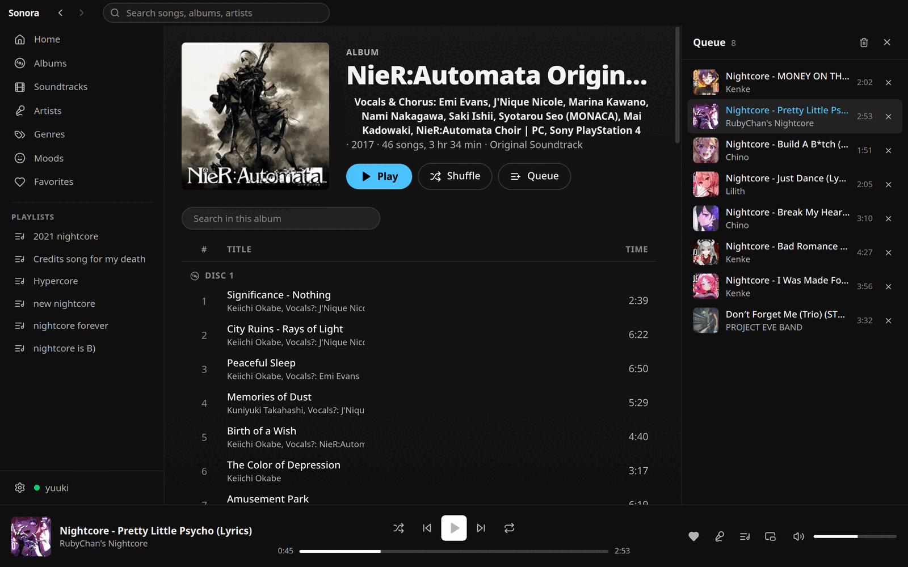
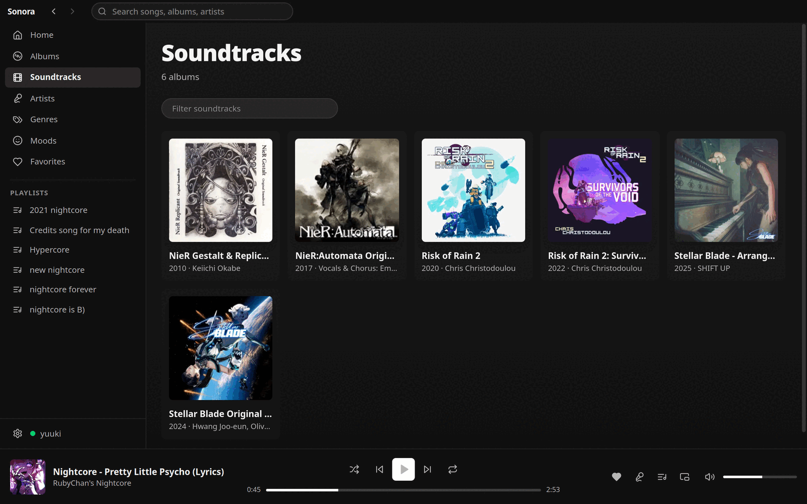
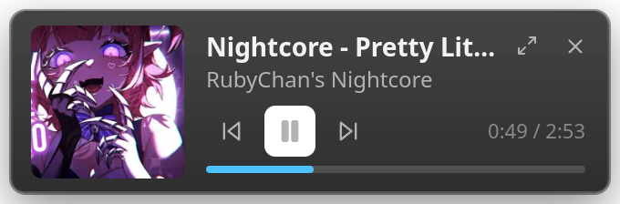
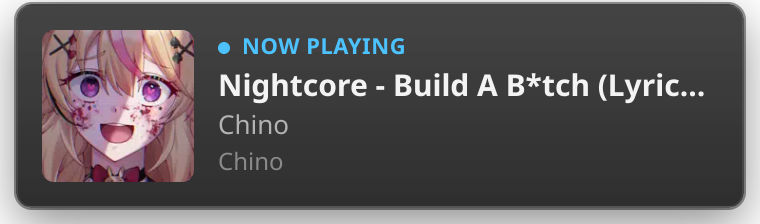
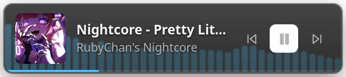

<div align="center">


# Sonora

**A Spotify-like desktop client for your own music server.**

Point it at a [Navidrome](https://www.navidrome.org/) (or any Subsonic/OpenSubsonic) server. It
gives you synced lyrics, Fluent 2 track-change toasts, a floating mini-player and a taskbar-area
widget with a live audio visualiser.

[](https://www.electronjs.org/)
[](https://react.dev)
[](https://www.typescriptlang.org/)
[](https://bun.sh)
[](#license)
[](#status)

</div>

> **⚠️ Work in progress.** Sonora is still in active development. Expect rough edges, missing
> features and breaking changes between commits; there are no stable releases yet.

---

## Screenshots

<table>
<tr>
<td width="50%">

**Home.** Pinned playlists, what you played last, what the server added last.


</td>
<td width="50%">

**Album.** Track list grouped by disc, with play, shuffle and queue buttons.


</td>
</tr>
<tr>
<td width="50%">

**Lyrics.** The highlighted line is extrapolated between 250ms position updates, so it stays on the beat instead of jumping four times a second.


</td>
<td width="50%">

**Queue.** Double-click a row to jump to it, X to drop one track, the bin to clear the lot.


</td>
</tr>
<tr>
<td colspan="2">

**Soundtracks.** Scores get their own view instead of drowning in the album grid, and a release split across discs shows up once.


</td>
</tr>
</table>

Three more windows, all driven by the same hidden audio host:

<table>
<tr>
<td width="33%">

**Mini-player.** Always on top, remembers where you dragged it.


</td>
<td width="33%">

**Toast.** Animates in on every track change, click-through.


</td>
<td width="33%">

**Taskbar widget.** Visualiser bars at ~30fps off an `AnalyserNode`.


</td>
</tr>
</table>

## Features

- 🎵 **Full library UI.** Home, albums, artists, playlists, search, favorites and a queue panel, all backed by the Subsonic API
- 🎤 **Synced Lyrics.** OpenSubsonic structured lyrics with an LRC/SRT/plain fallback, extrapolated between position updates so the highlighted line tracks the audio
- 🔔 **Fluent Toasts.** A frameless, click-through, always-on-top card that animates in on every track change
- 🪟 **Mini-player.** Draggable always-on-top player that remembers where you put it
- 📊 **Taskbar Widget.** Acrylic flyout pinned above the taskbar with a canvas visualiser fed by a Web Audio `AnalyserNode` at ~30fps
- ❤️ **Favorites.** Star anything from a track row or the now-playing bar; starred tracks collect into their own view
- ⏯ **Resume on Launch.** Playback state is persisted on quit and restored where you left off
- 🔐 **Encrypted Credentials.** Only the derived Subsonic token is stored, encrypted with Electron's `safeStorage`; the plain password is never persisted
- ⌨️ **Media Keys.** Global media-key support (toggleable) plus in-app shortcuts
- 🧪 **Mock Server.** A bundled OpenSubsonic mock with synthetic audio, art and synced lyrics, so you can develop with no server at all

## Tech Stack

| Layer | Choice |
|---|---|
| Shell | Electron 33 + electron-vite, packaged with electron-builder |
| Frontend | React 19, Zustand, Tailwind CSS 4, Lucide icons |
| Styling tokens | `@fluentui/tokens` (Fluent 2) |
| Storage | `electron-store` + `safeStorage` for credentials |
| Server API | Subsonic / OpenSubsonic (Navidrome) |
| Tooling | Bun (package manager, scripts, tests), TypeScript 5.7 |

## Requirements

- Windows 10/11 or Linux (X11 or Wayland). The floating widgets are tuned for the Windows 11 taskbar; on Linux they sit at the edge of the work area, and the tray needs an AppIndicator/StatusNotifier host (GNOME needs an extension such as AppIndicator Support)
- [Bun](https://bun.sh) 1.1+ as package manager / script runner (Electron itself still runs on its bundled Node)
- A Navidrome server, or none at all, see [Quick Start](#quick-start)

## Quick Start

```bash
bun install   # Electron is downloaded by its postinstall; it is in trustedDependencies
bun run go    # mock server on :4599 + Electron with Vite HMR
```

Sign in with `http://localhost:4599` and any username/password. Pass `--no-mock` to point at a real
server instead.

> If you launch Electron from inside another Electron app's terminal (VS Code, T3 Code, ...), make
> sure `ELECTRON_RUN_AS_NODE` is not set in the environment, otherwise Electron starts as plain
> Node. `bun run go` strips it for you; `bun run dev` does not.

## Scripts

| Command | What it does |
|---|---|
| `bun run go` | **Everything in one command**: mock server + Electron with Vite HMR. `--no-mock` to skip the mock server |
| `bun run dev` | Start Electron with Vite HMR for all renderer windows (no mock server) |
| `bun run build` | Production build into `out/` |
| `bun run start` | Run the production build |
| `bun run typecheck` | Type-check main/preload/shared/scripts and the renderer |
| `bun test` | Unit tests (lyrics parser, resume state) |
| `bun run mock` | Start a mock OpenSubsonic server on `http://localhost:4599` (any username/password) |
| `bun run api:test -- --server URL --user U --pass P` | Exercise the API client with no UI |
| `bun run smoke` | End-to-end IPC/playback check over the DevTools protocol (see below) |
| `bun run icons` | Regenerate `resources/icon.png` and tray icons |
| `bun run dist` | Build an installer for the current platform in `release/` (NSIS on Windows, AppImage + deb on Linux) |
| `bun run dist:dir` | Build an unpacked app folder in `release/win-unpacked/` or `release/linux-unpacked/` |

## Architecture

**Only one place ever touches the `<audio>` element.** A hidden "audio host" window
(`src/renderer/host`) owns playback, the queue, volume and a Web Audio `AnalyserNode`. Every visible
window is a pure display layer:

```
                       commands (play/pause/seek/setQueue/...)
  main UI ─────┐                                            ┌──▶ audio host (hidden)
  mini-player ─┼──▶ preload bridge ──▶ ipcMain relay ───────┤      <audio> + AnalyserNode
  taskbar widget┘        ▲                 │                └──◀ emits events
  toast                  └─────────────────┘
                 events (trackChanged, positionUpdate, playStateChanged,
                         queueChanged, volumeChanged, modeChanged, audioFrame)
```

- `src/shared/types.ts` holds the full event/command contract (`PlayerEvents`, `PlayerCommands`, `PlayerState`)
- `src/main/ipc.ts` relays host events to every window, caches the latest state so new windows hydrate instantly, forwards commands to the host, and streams `audioFrame` only to windows that asked for it
- `src/preload/index.ts` exposes `window.sonora` (`player.on/command/getState/wantFrames`, `auth`, `settings`, `window`, `toast`)
- `src/renderer/shared/playerStore.ts` exports `usePlayerState()` (Zustand) and the `player.*` command helpers used by every window

### Windows

| Window | Purpose |
|---|---|
| `main` | Library UI: sidebar, home, albums, artists, playlists, favorites, search, queue panel, lyrics, settings |
| `host` | Hidden audio host (`show: false`, background throttling off) |
| `toast` | Frameless, transparent, click-through, always-on-top card that animates in on `trackChanged` (single reused window) |
| `mini` | Draggable always-on-top mini-player, position remembered in settings |
| `widget` | "Taskbar" widget: acrylic flyout pinned to the bottom-right of the work area, right above the taskbar, with a canvas visualiser fed by `audioFrame` at ~30fps |

On Linux the tray icon has no left-click handler (most desktops only open the context menu), so use
the menu's **Show Sonora** entry.

Windows does not allow third-party apps to inject controls into the taskbar itself; the widget is a
small always-on-top window positioned next to the system tray, which is the same approach
FluentFlyout uses.

### Credentials

The password is used once to derive the Subsonic `token = md5(password + salt)`. Only
`{server, username, token, salt}` is stored, encrypted with Electron's `safeStorage` (DPAPI on
Windows, libsecret on Linux; without a keyring the derived token is stored unencrypted and a warning
is logged). The plain password is never persisted. `keytar` was not used because it is archived and
has no prebuilt binaries for current Electron versions.

### CORS and the visualiser

`AnalyserNode` needs the stream response to be CORS-readable. Navidrome already sends
`Access-Control-Allow-Origin: *` on `/rest`; for servers that do not, `src/main/index.ts` rewrites
the header on responses from the configured server only.

### Lyrics

`getLyricsBySongId` (OpenSubsonic structured lyrics, synced preferred) with a fallback to the legacy
`getLyrics` text endpoint, parsed as LRC/SRT/plain. The lyrics view extrapolates the playback
position between 250ms `positionUpdate` events on every animation frame, so the highlighted line
tracks the audio closely.

## Smoke test

```bash
bun run mock
bun run build && ./node_modules/.bin/electron . --remote-debugging-port=9222
bun run smoke           # signs in to the mock, plays, checks state from another window, then signs out
```

## Releasing

Releases are cut by the `Release` GitHub Actions workflow. It bumps the version in
`package.json`, tags the commit, builds the Windows installer and the Linux AppImage/deb in
parallel, and attaches all three to a GitHub release.

Trigger it from the **Actions** tab (**Release** → **Run workflow**) or from the CLI:

```bash
gh workflow run release.yml -f version=0.2.0   # no leading v, the workflow adds it
gh run watch                                   # follow it live
```

It always builds the default branch, so merge first. If a run fails partway, delete the tag
before retrying the same version (`git push --delete origin v0.2.0`) or the tag step will hit
the existing tag and fail.

The `.deb` maintainer lives in `electron-builder.yml` under `linux.maintainer`, because
`package.json`'s `author` has no email and fpm requires one. The Windows installer is unsigned,
so SmartScreen will warn until a certificate is wired up.

## Keyboard

- `Space` play/pause, `Ctrl+←/→` previous/next, `Ctrl+↑/↓` volume (main window)
- Media keys (global, can be disabled in Settings)

## Project Structure

```
sonora/
├── src/
│   ├── main/            # Electron main: windows, tray, IPC relay, store, credentials
│   ├── preload/         # window.sonora bridge
│   ├── shared/          # Types, Subsonic client, lyrics parser, formatters
│   └── renderer/
│       ├── main/        # Library UI (views/, components/)
│       ├── host/        # Hidden audio host: <audio> + AnalyserNode
│       ├── mini/        # Mini-player
│       ├── toast/       # Track-change toast
│       ├── widget/      # Taskbar widget + visualiser
│       └── shared/      # playerStore, theme, styles shared by every window
├── scripts/             # go, mock server, api-test, smoke, icon generation
├── tests/               # Bun unit tests
└── resources/           # App and tray icons
```

## Status

In development, not production-ready. Issues and PRs welcome.

## License

MIT.
